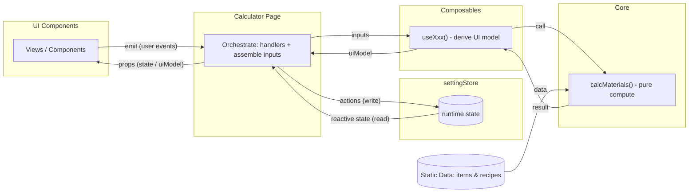

# Architecture and Data Flow (v1.0)

This document provides an architecture overview: module boundaries, responsibility layers, allowed dependency directions, and the overall path of runtime data/event flow (without going into concrete field-level interfaces).

For concrete props/emits communication and interface contracts, see: [`02-contracts.en.md`](02-contracts.en.md)  
For deployment and static data updates, see: [`03-deployment-data.en.md`](03-deployment-data.en.md)

## Module Boundaries and Responsibilities (Overview)

This project is layered by responsibility. Layers communicate via explicit inputs/outputs:

- `pages/` (orchestrator): assemble inputs, invoke derivation and calculations, push down the `uiModel` and handlers; receive UI events and write back to the store.
- `components/` (UI): pure presentation and interaction; only receive data via `props` and report events upward via `emits`.
- `composables/`: hold logic that is directly related to what the UI components display, and call into `core` when necessary.
- `core/`: pure computation and utility functions; does not depend on Vue.
- `utils/`: lightweight shared pure helpers reusable across layers; no Vue dependency and no orchestration.
- `settingStore` (State*): stores runtime state and user-selected dynamic data.
- `data/` (Static Data): static `items/recipes` data source (update flow, see 03).

The current `components/` tree is grouped by feature area:
- `components/common/`: shared UI shells such as `LoadingState`.
- `components/search/`: search UI such as `SearchPanel` / `ItemSearchBar` / `ItemSearchResults`.
- `components/targets/`: target-item UI such as `TargetItemPanel`.
- `components/materials/`: materials UI such as `MaterialsPanel` / `MaterialsToolbar` / `CanCraftSection` / `NotCraftSection` / `CrystalsSection`.
- `components/shell/`: app-shell UI such as `TopNav` / `OnboardingModal`.

*Note: `settingStore.js` currently lives physically under `composables/`.

## Logic Boundary

- **Core business logic (`core/`)**: only cares about input -> output and directly participates in the material-calculation pipeline. It should not contain UI semantics such as copy text, display formatting, or presentation-oriented grouping/sorting. Typical examples: recipe lookup, recipe picking, recursive expansion, demand aggregation, cycle guards.
- **Shared pure helpers (`utils/`)**: reusable helpers that do not drive the core calculation flow themselves, but are useful across layers. Typical examples: amount clamping, crystal element-name extraction, obtain-method priority.
- **UI formatting logic (`composables/` / `components/`)**: logic directly tied to presentation, such as display field composition, i18n text selection, or export-text structure.

## Data Flow

The project follows a stable one-way data flow: **state goes top-down, events go bottom-up**.

- Search/filter flow (pattern)  
  UI reports search intent → page writes query-related state → composable derives the result set → page sends it down to the UI to render → UI reports selection intent → page updates the target-related state.

- Material calculation flow (pattern)  
  Changes in target/selection state in the store → page assembles calculation inputs → composable calls `core` to get the calculation result and derives a `uiModel` → page sends it down to the UI for rendering (the UI only presents, it does not hold the actual state).

For detailed communication content, see: [`02-contracts.en.md`](02-contracts.en.md)

## Dependency Rules (import level)

The following rules keep boundaries clear and the one-way data flow stable:

- `components/`  
  Pure UI component layer: does not depend on other layers.

- `pages/`  
  Allowed to depend on (import): `settingStore` (call its interface only) / `composables/` / `data/` (imported for data processing)  
  Not allowed to depend on (import): `core/`

- `composables/`  
  Allowed to depend on (import): `core/` / `utils/` / `data/`  
  Not allowed to depend on (import): `components/` / `settingStore`

- `core/`  
  Contents should be: pure functions that directly participate in the core material-calculation flow
  Examples: recipe indexing, recipe selection, recursive expansion, demand aggregation, cycle guards
  Should not contain: generic helpers used only for sorting, grouping, string trimming, or value normalization

- `utils/`
  Allowed imports: none
  May be imported by: `components/` / `pages/` / `composables/` / `settingStore`
  Contents should be: lightweight pure helpers reusable across layers without owning the core calculation flow
  Examples: amount clamping, obtain-method priority, crystal element-name extraction

- `data/`  
  Read-only; does not depend on other layers.
