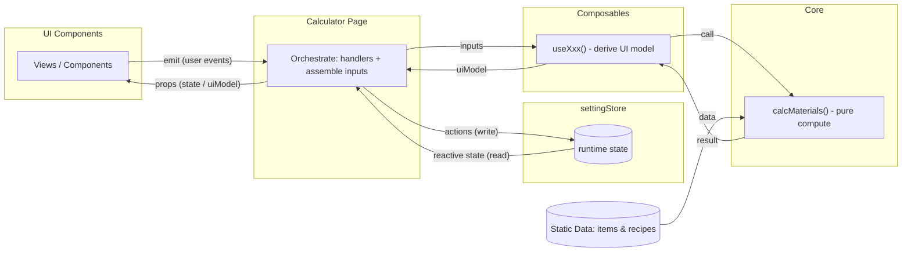

# 项目结构与数据流向（v1.0）

本文档提供架构概览：模块边界、职责分层、允许的依赖方向，以及运行时数据/事件流的总体路径（不包含具体接口字段）。

具体props/emits通信内容与接口约定见：[`02-contracts.md`](02-contracts.md)  
部署与静态数据更新见：[`03-deployment-data.md`](03-deployment-data.md)

## 模块边界与职责（Overview）

本项目按职责分层，层与层之间通过明确的输入/输出连接：

- `pages/`（Orchestrator）：组装输入、调用派生与计算、下发 `uiModel` 与 handlers；接收 UI 事件并写回 Store。
- `components/`（UI）：纯展示与交互；仅通过 `props` 接收数据、通过 `emits` 上报事件。
- `composables/`：负责与ui组件展示直接相关的逻辑，必要时调用 `core`。
- `core/`：纯计算与工具函数；不依赖 Vue。
- `utils/`：可被多层复用的轻量纯函数；不依赖 Vue，也不承载业务编排。
- `settingStore`（State*）：存储运行时状态与用户选择的动态数据。
- `data/`（Static Data）：静态 `items/recipes` 数据源（更新流程见 03）。

当前 `components/` 按业务区块细分：
- `components/common/`：通用展示壳，如 `LoadingState`。
- `components/search/`：搜索区块 UI，如 `SearchPanel` / `ItemSearchBar` / `ItemSearchResults`。
- `components/targets/`：目标成品区块 UI，如 `TargetItemPanel`。
- `components/materials/`：材料区块 UI，如 `MaterialsPanel` / `MaterialsToolbar` / `CanCraftSection` / `NotCraftSection` / `CrystalsSection`。
- `components/shell/`：应用壳层 UI，如 `TopNav` / `OnboardingModal`。

*注：`settingStore.js` 物理位置目前在 `composables/` 

### 逻辑分界：纯业务逻辑 vs UI 格式化逻辑
- **纯业务逻辑（Core）**：只关心“输入 → 输出”，不包含任何 UI 语义（例如语言文案、展示格式、排序/分组策略）。  
  典型例子：材料拆解计算、配方选择、递归展开边界、循环保护等。
- **通用纯工具（Utils）**：不直接决定核心计算流程，但可被多层复用；通常是通用归一化、领域枚举映射、展示前的轻量派生。  
  典型例子：数量 clamp、水晶元素名提取、获取途径优先级。
- **UI 格式化逻辑（Composables / Components）**：与界面呈现直接相关，例如：  
  - 显示字段拼接（`displayAmount` / `displaySuffix`）；  
  - 文案与 i18n（按钮标题、提示语）；  
  - 展示排序（按语言排序、展开优先等）；  
  - 导出文本格式。  
- **Page 层**只负责“组装输入 + 调用计算 + 下发 UI 模型 + 处理事件”，不承担业务细节。

这条分界的目的：避免 UI 文案/格式侵入 core，保证 core 纯函数可复用，UI 层只专注展示与交互。

## 数据流向
项目遵循稳定的单向数据流：**状态自上而下、事件自下而上**。

- 搜索/筛选类链路（模式）
UI 上报查询意图 → Page 写入查询相关状态 → composable 派生结果集合 → Page 下发给 UI 渲染 → UI 上报选择意图 → Page 更新目标相关状态

- 材料计算类链路（模式）
Store 中的目标/选择状态变化 → Page 组装计算输入 → composable 调用 core 得到计算结果并派生为 uiModel → Page 下发给 UI 渲染（UI 仅展示，不持有真状态）

具体通信内容：[`02-contracts.md`](02-contracts.md)

## 依赖规则（import 级别）

以下规则用于保持边界清晰与单向数据流稳定：

- `components/`  
  纯 UI 组件层：不依赖其他层。

- `pages/`  
  允许依赖（import）：`settingStore`（只调用接口） / `composables/` / `data/`（导入做数据处理）  
  不允许依赖（import）：`core/`

- `composables/`  
  允许依赖（import）：`core/` / `utils/` / `data/`  
  不允许依赖（import）：`components` / `settingStore`

- `core/`  
  不允许依赖`data/`
  内容应当是：直接参与核心材料计算流程的纯函数
  例如：配方索引、配方选择、递归拆解、需求汇总、循环保护
  不应放入：仅用于排序/归类/名称截取/数值归一化的通用工具

- `utils/`
  允许依赖（import）：无
  允许被依赖（import）：`components/` / `pages/` / `composables/` / `settingStore`
  内容应当是：不驱动核心计算，但可跨层复用的轻量纯函数
  例如：数量 clamp、获取途径优先级、水晶元素名提取

- `data/`  
  只允许被读取，不依赖其他层。
