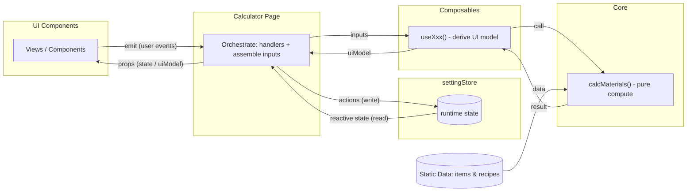

# 项目结构与数据流向（v1.0）

本文档提供架构概览：模块边界、职责分层、允许的依赖方向，以及运行时数据/事件流的总体路径（不包含具体接口字段）。

具体props/emits通信内容与接口约定见：[`02-contracts.md`](02-contracts.md)  
部署与静态数据更新见：[`03-deployment-data.md`](03-deployment-data.md)

## 模块边界与职责（Overview）

本项目按职责分层，层与层之间通过明确的输入/输出连接：

- `pages/`（Orchestrator）：组装输入、调用派生与计算、下发 `uiModel` 与 handlers；接收 UI 事件并写回 Store。
- `components/`（UI）：纯展示与交互；仅通过 `props` 接收数据、通过 `emits` 上报事件。
- `composables/`：负责与ui组件展示直接相关的逻辑，必要时调用 `core`。
- `core/`：纯计算与工具函数；不依赖 Vue。
- `settingStore`（State*）：存储运行时状态与用户选择的动态数据。
- `data/`（Static Data）：静态 `items/recipes` 数据源（更新流程见 03）。

*注：`settingStore.js` 物理位置目前在 `composables/` 

## 数据流向
项目遵循稳定的单向数据流：**状态自上而下、事件自下而上**。

- 搜索/筛选类链路（模式）
UI 上报查询意图 → Page 写入查询相关状态 → composable 派生结果集合 → Page 下发给 UI 渲染 → UI 上报选择意图 → Page 更新目标相关状态

- 材料计算类链路（模式）
Store 中的目标/选择状态变化 → Page 组装计算输入 → composable 调用 core 得到计算结果并派生为 uiModel → Page 下发给 UI 渲染（UI 仅展示，不持有真状态）

具体通信内容：[`02-contracts.md`](02-contracts.md)

## 依赖规则（import 级别）

以下规则用于保持边界清晰与单向数据流稳定：

- `components/`  
  纯 UI 组件层：不依赖其他层。

- `pages/`  
  允许依赖（import）：`settingStore`（只调用接口） / `composables/` / `data/`（导入做数据处理）  
  不允许依赖（import）：`core/`

- `composables/`  
  允许依赖（import）：`core/` / `data/`  
  不允许依赖（import）：`components` / `settingStore`

- `core/`  
  `calcMaterials`：允许依赖（import）`data/` 静态数据，并导入 `core/` 内其他工具函数  
  `core/` 内其他工具函数：只接收输入并返回结果，不依赖其他层

- `data/`  
  只允许被读取，不依赖其他层。

